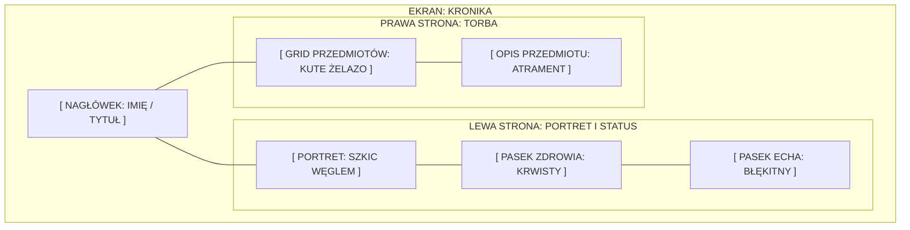

# SPECYFIKACJA INTERFEJSU GRIMREICH (UI SPEC) - 2026-07-14

## 1. Koncepcja Przewodnia: "Pęknięta Kronika"
Interfejs w GrimReich nie jest tylko nakładką graficzną, lecz fizyczną **Kroniką Świata**, którą trzyma gracz (Kotwica). Wszystkie ekrany menu są stronami tej księgi.

## 2. Paleta Kolorów (Hex Codes)
| Element | Kolor (HEX) | Znaczenie |
| :--- | :--- | :--- |
| **Tło Pergaminu** | `#D2B48C` | Stary, pożółkły papier |
| **Tekst Główny** | `#2F2F2F` | Ciemny atrament |
| **HP (Krew)** | `#8B0000` | Życie, pasja, walka |
| **Echo (Mana)** | `#00CED1` | Ontologia, pęknięcie, magia |
| **Ramki (Żelazo)** | `#1A1A1A` | Surowość, więzienie, stal |
| **Złoto (Relikty)** | `#DAA520` | Rzadkość, sacrum |

## 3. Typografia
*   **Nagłówki (H1, H2):** *MedievalSharp* lub *Cloister Black*.
*   **Treść (Body):** *EB Garamond* lub *Crimson Text*.
*   **Wpisy Meta:** *Courier New* (symulacja maszynopisu w świecie średniowiecznym - "błąd paradygmatu").

## 4. Makieta Ekwipunku (Layout)

## 5. Efekty Wizualne (Visual FX)
1.  **Shaking UI:** Wybory dialogowe, które niszczą stabilność, powinny delikatnie drżeć.
2.  **Ink Bleeding:** Tekst przy niskim HP powinien wyglądać, jakby atrament się rozmywał.
3.  **Alpha Portrety:** NPC nie mają tła w oknie dialogowym – wyłaniają się bezpośrednio z ciemności lokacji.

---
*Dokument zatwierdzony przez Agenta Stabilizacji GrimReich.*
